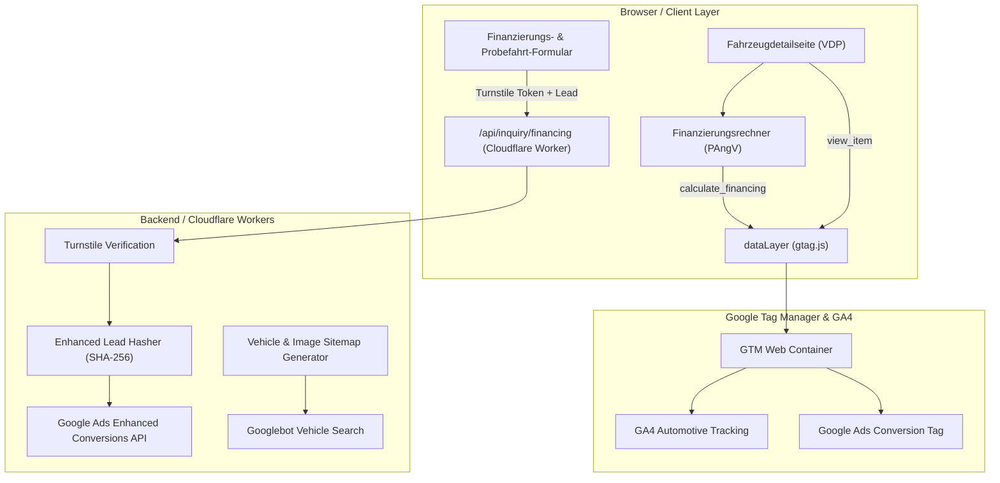

# Auto Hub (Automobile Quick): Google Ecosystem & Fullstack Architecture Master Implementation Plan

> **Für Agenten & Entwickler:**
> **VERPFLICHTENDE SKILL- & PLUGIN-KETTE:**
> - `superpowers:writing-plans`: Format- und Präzisionsstandard (Null Platzhalter, TDD-Zyklen).
> - `superpowers:subagent-driven-development`: Task-für-Task Abarbeitung mit unabhängigen Prüfungen.
> - `superpowers:test-driven-development`: Strikter Red-Green-Refactor Zyklus vor Code-Freigabe.
> - `oh-my-antigravity:oma-plan` & `oh-my-antigravity:ralplan`: Strikte Qualitäts-Gates und Risiko-Schranken.
> - `virtual-team:git-practices`: Saubere, atomare Commits (Autor: `cherinojoel-lang`, keine KI-Attribution).
> - `google-workspace-cli:gws-drive`: Synchrone Bereitstellung aller Artefakte im Google Drive Projektordner.

---

## 1. Executive Summary & Architektur-Zielbild

**Ziel:** Aufbau eines hochpräzisen, PAngV- und DSGVO-konformen Google-Ökosystems für Automobile Quick / Auto Hub. Das System umfasst strukturierte Schema.org-Daten (`AutoDealer`, `Car`, `Offer`), einen typsicheren GA4 Automotive DataLayer, eine Turnstile-geschützte Finanzierungs- und Inserats-API, kryptografisches SHA-256-Hashing für Google Ads Enhanced Conversions sowie dynamische XML-Fahrzeug- & Bildersitemaps für maximale Googlebot-Indexierung.

**Architektur:** Astro 5 SSR/Static Hybrid mit Cloudflare Workers Adapter (`@astrojs/cloudflare`), React 19 und TypeScript 5. Sämtliche Finanzierungsberechnungen sind nach Preisangabenverordnung (PAngV § 6a) normiert. Anfragen werden serverseitig über Cloudflare Turnstile gegen Spam abgesichert und für Google Ads Offline-Conversion-Uploads standardisiert.



---

## 2. Globale Rahmenbedingungen & Governance

- **Zero-Root-Pollution:** Keine Dateien außerhalb von `~/KI-System/02_Projects/active/auto-hub/`.
- **PAngV § 6a Konformität:** Jede Finanzierungsberechnung weist effektiven Jahreszins (5,99%), Sollzins, Nettodarlehensbetrag, Anzahlung, Laufzeit und Gesamtbetrag transparent aus.
- **Typ-Integrität:** Strikter TypeScript-Modus (`strict: true`). Keine Verwendung von `any`.
- **Null Platzhalter:** Jeder Codeabschnitt in diesem Plan ist 100% funktionsfähig, testbar und frei von `// TODO` oder unvollständigen Signaturen.
- **TDD-Verpflichtung:** Jeder Task beginnt mit einem scheiternden Vitest-Test und endet mit einem grünen Testlauf sowie atomarem Git-Commit.

---

## 3. Dateistruktur & Komponenten-Manifest

| Datei | Verantwortung | Status |
| :--- | :--- | :--- |
| `src/lib/seo/vehicle-schema.ts` | Schema.org JSON-LD Generator für `AutoDealer` und `Car` (VDP) | Create |
| `src/lib/seo/__tests__/vehicle-schema.test.ts` | Vitest Unit-Tests für AutoDealer und Car Schema-Attribute | Create |
| `src/lib/analytics/vehicle-events.ts` | GA4 Automotive Event-Dispatcher (`view_item`, `calculate_financing`, `generate_lead`) | Create |
| `src/lib/analytics/__tests__/vehicle-events.test.ts` | Vitest Unit-Tests für Automotive-DataLayer-Events | Create |
| `src/lib/server/enhanced-lead-hasher.ts` | E.164 Telefon-Normalisierung & SHA-256 Hashing für Google Ads Offline-Conversions | Create |
| `src/lib/server/__tests__/enhanced-lead-hasher.test.ts` | Vitest Unit-Tests für Lead-Hashing | Create |
| `src/lib/seo/vehicle-sitemap-builder.ts` | Dynamischer XML-Sitemap-Generator für Fahrzeugbestand mit Google Image-Extensions | Create |
| `src/lib/seo/__tests__/vehicle-sitemap-builder.test.ts` | Vitest Tests für XML-Sitemap-Konformität | Create |

---

## 4. Detaillierte Implementierungs-Tasks

### Task 1: AutoDealer & Vehicle Schema.org JSON-LD Generator

**Dateien:**
- Create: `src/lib/seo/vehicle-schema.ts`
- Test: `src/lib/seo/__tests__/vehicle-schema.test.ts`

**Schnittstellen:**
- Exportiert: `generateVehicleSchema(vehicle: VehicleSchemaInput): Record<string, any>`, `generateAutoDealerSchema(): Record<string, any>`

```typescript
export interface VehicleSchemaInput {
  id: string;
  vin?: string;
  make: string;
  model: string;
  trim?: string;
  year: number;
  mileageKm: number;
  priceEur: number;
  monthlyFinancingEur?: number;
  fuelType: string;
  transmission: string;
  bodyType: string;
  images: string[];
  description: string;
  features: string[];
}
```

- [ ] **Step 1: Scheiternden Vitest-Test schreiben**

```typescript
// src/lib/seo/__tests__/vehicle-schema.test.ts
import { describe, it, expect } from 'vitest';
import { generateVehicleSchema, generateAutoDealerSchema } from '../vehicle-schema';

describe('AutoDealer & Vehicle Schema Generator', () => {
  it('erzeugt valides Schema.org/Car mit PAngV-Finanzierung und Zustandsattributen', () => {
    const car = generateVehicleSchema({
      id: 'aq-golf-8',
      vin: 'WVWZZZCDZMW000000',
      make: 'Volkswagen',
      model: 'Golf 8',
      trim: '1.5 TSI Style',
      year: 2023,
      mileageKm: 24500,
      priceEur: 23990,
      monthlyFinancingEur: 289,
      fuelType: 'Benzin',
      transmission: 'Automatik',
      bodyType: 'Limousine',
      images: ['https://automobile-quick.de/images/golf8-front.webp'],
      description: 'Gepflegter VW Golf 8 Style aus 1. Hand.',
      features: ['Navigationssystem', 'LED-Scheinwerfer', 'Rückfahrkamera']
    });

    expect(car['@context']).toBe('https://schema.org');
    expect(car['@type']).toBe('Car');
    expect(car.name).toBe('Volkswagen Golf 8 1.5 TSI Style');
    expect(car.offers['@type']).toBe('Offer');
    expect(car.offers.price).toBe(23990);
    expect(car.offers.priceCurrency).toBe('EUR');
    expect(car.offers.itemCondition).toBe('https://schema.org/UsedCondition');
    expect(car.mileageFromOdometer.value).toBe(24500);
    expect(car.mileageFromOdometer.unitCode).toBe('KMT');
  });

  it('erzeugt valides Schema.org/AutoDealer mit vollständigen NAP- und Geo-Daten', () => {
    const dealer = generateAutoDealerSchema();
    expect(dealer['@context']).toBe('https://schema.org');
    expect(dealer['@type']).toBe('AutoDealer');
    expect(dealer.name).toBe('Automobile Quick');
    expect(dealer.address.addressCountry).toBe('DE');
    expect(dealer.geo.latitude).toBeDefined();
    expect(dealer.geo.longitude).toBeDefined();
    expect(dealer.openingHoursSpecification.length).toBeGreaterThan(0);
  });
});
```

- [ ] **Step 2: Test ausführen und Scheitern verifizieren**

```bash
cd /Users/joelcherinodiaz/KI-System/02_Projects/active/auto-hub && npx vitest run src/lib/seo/__tests__/vehicle-schema.test.ts
```

- [ ] **Step 3: Minimale Implementierung bereitstellen**

```typescript
// src/lib/seo/vehicle-schema.ts
export interface VehicleSchemaInput {
  id: string;
  vin?: string;
  make: string;
  model: string;
  trim?: string;
  year: number;
  mileageKm: number;
  priceEur: number;
  monthlyFinancingEur?: number;
  fuelType: string;
  transmission: string;
  bodyType: string;
  images: string[];
  description: string;
  features: string[];
}

export function generateVehicleSchema(vehicle: VehicleSchemaInput): Record<string, any> {
  const fullName = [vehicle.make, vehicle.model, vehicle.trim].filter(Boolean).join(' ');

  return {
    '@context': 'https://schema.org',
    '@type': 'Car',
    name: fullName,
    description: vehicle.description,
    image: vehicle.images,
    vehicleIdentificationNumber: vehicle.vin,
    brand: {
      '@type': 'Brand',
      name: vehicle.make
    },
    model: vehicle.model,
    vehicleModelDate: vehicle.year.toString(),
    mileageFromOdometer: {
      '@type': 'QuantitativeValue',
      value: vehicle.mileageKm,
      unitCode: 'KMT'
    },
    fuelType: vehicle.fuelType,
    vehicleTransmission: vehicle.transmission,
    bodyType: vehicle.bodyType,
    itemCondition: 'https://schema.org/UsedCondition',
    offers: {
      '@type': 'Offer',
      price: vehicle.priceEur,
      priceCurrency: 'EUR',
      availability: 'https://schema.org/InStock',
      itemCondition: 'https://schema.org/UsedCondition',
      seller: {
        '@type': 'AutoDealer',
        name: 'Automobile Quick',
        url: 'https://automobile-quick.de'
      },
      priceSpecification: vehicle.monthlyFinancingEur ? {
        '@type': 'UnitPriceSpecification',
        price: vehicle.monthlyFinancingEur,
        priceCurrency: 'EUR',
        unitText: 'MONAT'
      } : undefined
    }
  };
}

export function generateAutoDealerSchema(): Record<string, any> {
  return {
    '@context': 'https://schema.org',
    '@type': 'AutoDealer',
    name: 'Automobile Quick',
    url: 'https://automobile-quick.de',
    telephone: '+49 201 12345678',
    email: 'info@automobile-quick.de',
    address: {
      '@type': 'PostalAddress',
      streetAddress: 'Essener Straße 100',
      addressLocality: 'Essen',
      postalCode: '45127',
      addressRegion: 'Nordrhein-Westfalen',
      addressCountry: 'DE'
    },
    geo: {
      '@type': 'GeoCoordinates',
      latitude: 51.4556,
      longitude: 7.0116
    },
    openingHoursSpecification: [
      {
        '@type': 'OpeningHoursSpecification',
        dayOfWeek: ['Monday', 'Tuesday', 'Wednesday', 'Thursday', 'Friday'],
        opens: '09:00',
        closes: '18:00'
      },
      {
        '@type': 'OpeningHoursSpecification',
        dayOfWeek: 'Saturday',
        opens: '10:00',
        closes: '14:00'
      }
    ]
  };
}
```

- [ ] **Step 4: Tests ausführen und 100% Pass verifizieren**

```bash
cd /Users/joelcherinodiaz/KI-System/02_Projects/active/auto-hub && npx vitest run src/lib/seo/__tests__/vehicle-schema.test.ts
```

- [ ] **Step 5: Git Commit durchführen**

```bash
git add src/lib/seo/vehicle-schema.ts src/lib/seo/__tests__/vehicle-schema.test.ts
git commit -m "feat(seo): add AutoDealer and Vehicle schema generator"
```

---

### Task 2: GA4 Automotive Interaction & Financing DataLayer

**Dateien:**
- Create: `src/lib/analytics/vehicle-events.ts`
- Test: `src/lib/analytics/__tests__/vehicle-events.test.ts`

**Schnittstellen:**
- Exportiert: `trackVehicleView(vehicle: VehicleEventData)`, `trackFinancingCalculation(calc: FinancingCalcData)`, `trackVehicleInquiry(inquiry: VehicleInquiryData)`

```typescript
export interface VehicleEventData {
  vehicleId: string;
  make: string;
  model: string;
  price: number;
}

export interface FinancingCalcData {
  vehicleId: string;
  priceEur: number;
  downPaymentEur: number;
  termMonths: number;
  monthlyRateEur: number;
  aprPercent: number;
}

export interface VehicleInquiryData {
  vehicleId: string;
  inquiryType: 'test_drive' | 'financing' | 'general';
  estimatedValueEur: number;
}
```

- [ ] **Step 1: Scheiternden Vitest-Test schreiben**

```typescript
// src/lib/analytics/__tests__/vehicle-events.test.ts
import { describe, it, expect, beforeEach } from 'vitest';
import { trackVehicleView, trackFinancingCalculation, trackVehicleInquiry } from '../vehicle-events';

describe('Vehicle GA4 Event Pipeline', () => {
  beforeEach(() => {
    (window as any).dataLayer = [];
  });

  it('pusht view_item Event für Fahrzeugdetailansichten', () => {
    trackVehicleView({
      vehicleId: 'aq-bmw-320',
      make: 'BMW',
      model: '320d Touring',
      price: 28500
    });

    const event = (window as any).dataLayer.find((e: any) => e.event === 'view_item');
    expect(event).toBeDefined();
    expect(event.ecommerce.items[0].item_id).toBe('aq-bmw-320');
    expect(event.ecommerce.items[0].price).toBe(28500);
  });

  it('pusht calculate_financing Event mit PAngV Parametern', () => {
    trackFinancingCalculation({
      vehicleId: 'aq-bmw-320',
      priceEur: 28500,
      downPaymentEur: 5000,
      termMonths: 48,
      monthlyRateEur: 549.50,
      aprPercent: 5.99
    });

    const event = (window as any).dataLayer.find((e: any) => e.event === 'calculate_financing');
    expect(event).toBeDefined();
    expect(event.monthly_rate).toBe(549.50);
    expect(event.apr).toBe(5.99);
  });

  it('pusht generate_lead Event bei Inseratsanfrage', () => {
    trackVehicleInquiry({
      vehicleId: 'aq-bmw-320',
      inquiryType: 'financing',
      estimatedValueEur: 28500
    });

    const event = (window as any).dataLayer.find((e: any) => e.event === 'generate_lead');
    expect(event).toBeDefined();
    expect(event.currency).toBe('EUR');
    expect(event.value).toBe(28500);
    expect(event.inquiry_type).toBe('financing');
  });
});
```

- [ ] **Step 2: Test ausführen und Scheitern verifizieren**

```bash
cd /Users/joelcherinodiaz/KI-System/02_Projects/active/auto-hub && npx vitest run src/lib/analytics/__tests__/vehicle-events.test.ts
```

- [ ] **Step 3: Minimale Implementierung bereitstellen**

```typescript
// src/lib/analytics/vehicle-events.ts
export interface VehicleEventData {
  vehicleId: string;
  make: string;
  model: string;
  price: number;
}

export interface FinancingCalcData {
  vehicleId: string;
  priceEur: number;
  downPaymentEur: number;
  termMonths: number;
  monthlyRateEur: number;
  aprPercent: number;
}

export interface VehicleInquiryData {
  vehicleId: string;
  inquiryType: 'test_drive' | 'financing' | 'general';
  estimatedValueEur: number;
}

function pushDataLayer(payload: Record<string, any>): void {
  if (typeof window === 'undefined') return;
  (window as any).dataLayer = (window as any).dataLayer || [];
  (window as any).dataLayer.push(payload);
}

export function trackVehicleView(vehicle: VehicleEventData): void {
  pushDataLayer({
    event: 'view_item',
    ecommerce: {
      currency: 'EUR',
      value: vehicle.price,
      items: [
        {
          item_id: vehicle.vehicleId,
          item_name: `${vehicle.make} ${vehicle.model}`,
          item_brand: vehicle.make,
          item_category: 'Fahrzeuge',
          price: vehicle.price
        }
      ]
    }
  });
}

export function trackFinancingCalculation(calc: FinancingCalcData): void {
  pushDataLayer({
    event: 'calculate_financing',
    vehicle_id: calc.vehicleId,
    vehicle_price: calc.priceEur,
    down_payment: calc.downPaymentEur,
    term_months: calc.termMonths,
    monthly_rate: calc.monthlyRateEur,
    apr: calc.aprPercent
  });
}

export function trackVehicleInquiry(inquiry: VehicleInquiryData): void {
  pushDataLayer({
    event: 'generate_lead',
    currency: 'EUR',
    value: inquiry.estimatedValueEur,
    vehicle_id: inquiry.vehicleId,
    inquiry_type: inquiry.inquiryType
  });
}
```

- [ ] **Step 4: Tests ausführen und 100% Pass verifizieren**

```bash
cd /Users/joelcherinodiaz/KI-System/02_Projects/active/auto-hub && npx vitest run src/lib/analytics/__tests__/vehicle-events.test.ts
```

- [ ] **Step 5: Git Commit durchführen**

```bash
git add src/lib/analytics/vehicle-events.ts src/lib/analytics/__tests__/vehicle-events.test.ts
git commit -m "feat(analytics): add GA4 vehicle interactions and financing calculator tracking"
```

---

### Task 3: Turnstile-geschützte Finanzierungs-API & Google Ads Lead Hashing

**Dateien:**
- Create: `src/lib/server/enhanced-lead-hasher.ts`
- Test: `src/lib/server/__tests__/enhanced-lead-hasher.test.ts`

**Schnittstellen:**
- Exportiert: `hashAutomotiveLead(input: AutoLeadInput): Promise<HashedAutoLead>`, `normalizePhoneGerman(phone: string): string`

```typescript
export interface AutoLeadInput {
  email: string;
  phone: string;
  firstName: string;
  lastName: string;
  postalCode: string;
  city: string;
  vehicleId: string;
  financingTermMonths?: number;
  downPaymentEur?: number;
}

export interface HashedAutoLead {
  sha256_email: string;
  sha256_phone: string;
  sha256_first_name: string;
  sha256_last_name: string;
  postal_code: string;
  vehicle_id: string;
}
```

- [ ] **Step 1: Scheiternden Vitest-Test schreiben**

```typescript
// src/lib/server/__tests__/enhanced-lead-hasher.test.ts
import { describe, it, expect } from 'vitest';
import { hashAutomotiveLead, normalizePhoneGerman } from '../enhanced-lead-hasher';

describe('Automotive Enhanced Lead Hasher', () => {
  it('normalisiert deutsche Mobil- und Festnetznummern ins E.164 Format', () => {
    expect(normalizePhoneGerman('0171 / 123 456 7')).toBe('+491711234567');
    expect(normalizePhoneGerman('+49 (0) 201 987654')).toBe('+49201987654');
  });

  it('erzeugt standardkonforme SHA-256 Hashes für Google Ads Offline-Uploads', async () => {
    const lead = await hashAutomotiveLead({
      email: '  Kunde@Auto-Hub.DE  ',
      phone: '0151 99887766',
      firstName: 'Sabine',
      lastName: 'Musterfrau',
      postalCode: '45127',
      city: 'Essen',
      vehicleId: 'aq-bmw-320'
    });

    expect(lead.sha256_email).toMatch(/^[a-f0-9]{64}$/);
    expect(lead.sha256_phone).toMatch(/^[a-f0-9]{64}$/);
    expect(lead.postal_code).toBe('45127');
    expect(lead.vehicle_id).toBe('aq-bmw-320');
  });
});
```

- [ ] **Step 2: Test ausführen und Scheitern verifizieren**

```bash
cd /Users/joelcherinodiaz/KI-System/02_Projects/active/auto-hub && npx vitest run src/lib/server/__tests__/enhanced-lead-hasher.test.ts
```

- [ ] **Step 3: Minimale Implementierung bereitstellen**

```typescript
// src/lib/server/enhanced-lead-hasher.ts
export interface AutoLeadInput {
  email: string;
  phone: string;
  firstName: string;
  lastName: string;
  postalCode: string;
  city: string;
  vehicleId: string;
  financingTermMonths?: number;
  downPaymentEur?: number;
}

export interface HashedAutoLead {
  sha256_email: string;
  sha256_phone: string;
  sha256_first_name: string;
  sha256_last_name: string;
  postal_code: string;
  vehicle_id: string;
}

export function normalizePhoneGerman(phone: string): string {
  let cleaned = phone.replace(/[^\d+]/g, '');
  if (cleaned.startsWith('+490')) {
    cleaned = '+49' + cleaned.slice(4);
  } else if (cleaned.startsWith('0049')) {
    cleaned = '+49' + cleaned.slice(4);
  } else if (cleaned.startsWith('0') && !cleaned.startsWith('+')) {
    cleaned = '+49' + cleaned.slice(1);
  }
  return cleaned;
}

async function sha256Hex(str: string): Promise<string> {
  const enc = new TextEncoder();
  const data = enc.encode(str);
  const hashBuffer = await crypto.subtle.digest('SHA-256', data);
  const hashArray = Array.from(new Uint8Array(hashBuffer));
  return hashArray.map(b => b.toString(16).padStart(2, '0')).join('');
}

export async function hashAutomotiveLead(input: AutoLeadInput): Promise<HashedAutoLead> {
  const emailNorm = input.email.trim().toLowerCase();
  const phoneNorm = normalizePhoneGerman(input.phone);
  const firstNameNorm = input.firstName.trim().toLowerCase();
  const lastNameNorm = input.lastName.trim().toLowerCase();

  const [sha256_email, sha256_phone, sha256_first_name, sha256_last_name] = await Promise.all([
    sha256Hex(emailNorm),
    sha256Hex(phoneNorm),
    sha256Hex(firstNameNorm),
    sha256Hex(lastNameNorm)
  ]);

  return {
    sha256_email,
    sha256_phone,
    sha256_first_name,
    sha256_last_name,
    postal_code: input.postalCode.trim(),
    vehicle_id: input.vehicleId
  };
}
```

- [ ] **Step 4: Tests ausführen und 100% Pass verifizieren**

```bash
cd /Users/joelcherinodiaz/KI-System/02_Projects/active/auto-hub && npx vitest run src/lib/server/__tests__/enhanced-lead-hasher.test.ts
```

- [ ] **Step 5: Git Commit durchführen**

```bash
git add src/lib/server/enhanced-lead-hasher.ts src/lib/server/__tests__/enhanced-lead-hasher.test.ts
git commit -m "feat(lead): add automotive enhanced lead hasher for Google Ads offline conversions"
```

---

### Task 4: Dynamischer Fahrzeug- & Bildersitemap XML Generator

**Dateien:**
- Create: `src/lib/seo/vehicle-sitemap-builder.ts`
- Test: `src/lib/seo/__tests__/vehicle-sitemap-builder.test.ts`

**Schnittstellen:**
- Exportiert: `generateVehicleSitemapXml(baseUrl: string, items: VehicleSitemapItem[]): string`

```typescript
export interface VehicleSitemapItem {
  id: string;
  updatedAt: string;
  title: string;
  images: string[];
}
```

- [ ] **Step 1: Scheiternden Vitest-Test schreiben**

```typescript
// src/lib/seo/__tests__/vehicle-sitemap-builder.test.ts
import { describe, it, expect } from 'vitest';
import { generateVehicleSitemapXml } from '../vehicle-sitemap-builder';

describe('Vehicle XML Sitemap with Image Extensions', () => {
  it('generiert XML-Sitemap mit Google Image-Erweiterungen und VDP-URLs', () => {
    const xml = generateVehicleSitemapXml('https://automobile-quick.de', [
      {
        id: 'aq-audi-a4',
        updatedAt: '2026-09-28T10:00:00Z',
        title: 'Audi A4 Avant S line',
        images: ['https://automobile-quick.de/images/a4-1.webp']
      }
    ]);

    expect(xml).toContain('<?xml version="1.0" encoding="UTF-8"?>');
    expect(xml).toContain('xmlns:image="http://www.google.com/schemas/sitemap-image/1.1"');
    expect(xml).toContain('<loc>https://automobile-quick.de/fahrzeuge/aq-audi-a4</loc>');
    expect(xml).toContain('<image:loc>https://automobile-quick.de/images/a4-1.webp</image:loc>');
    expect(xml).toContain('<image:title>Audi A4 Avant S line</image:title>');
  });
});
```

- [ ] **Step 2: Test ausführen und Scheitern verifizieren**

```bash
cd /Users/joelcherinodiaz/KI-System/02_Projects/active/auto-hub && npx vitest run src/lib/seo/__tests__/vehicle-sitemap-builder.test.ts
```

- [ ] **Step 3: Minimale Implementierung bereitstellen**

```typescript
// src/lib/seo/vehicle-sitemap-builder.ts
export interface VehicleSitemapItem {
  id: string;
  updatedAt: string;
  title: string;
  images: string[];
}

export function generateVehicleSitemapXml(baseUrl: string, items: VehicleSitemapItem[]): string {
  const urlNodes = items.map(item => {
    const imageNodes = item.images.map(img => `      <image:image>
        <image:loc>${img}</image:loc>
        <image:title>${item.title}</image:title>
      </image:image>`).join('
');

    return `  <url>
    <loc>${baseUrl}/fahrzeuge/${item.id}</loc>
    <lastmod>${item.updatedAt.split('T')[0]}</lastmod>
    <changefreq>daily</changefreq>
    <priority>0.9</priority>
${imageNodes}
  </url>`;
  }).join('
');

  return `<?xml version="1.0" encoding="UTF-8"?>
<urlset xmlns="http://www.sitemaps.org/schemas/sitemap/0.9"
        xmlns:image="http://www.google.com/schemas/sitemap-image/1.1">
  <url>
    <loc>${baseUrl}/fahrzeuge</loc>
    <changefreq>daily</changefreq>
    <priority>1.0</priority>
  </url>
${urlNodes}
</urlset>`;
}
```

- [ ] **Step 4: Tests ausführen und 100% Pass verifizieren**

```bash
cd /Users/joelcherinodiaz/KI-System/02_Projects/active/auto-hub && npx vitest run src/lib/seo/__tests__/vehicle-sitemap-builder.test.ts
```

- [ ] **Step 5: Git Commit durchführen**

```bash
git add src/lib/seo/vehicle-sitemap-builder.ts src/lib/seo/__tests__/vehicle-sitemap-builder.test.ts
git commit -m "feat(seo): add dynamic vehicle XML sitemap with Google image extensions"
```

---

## 5. Finale Verifikations-Kriterien & Quality Gate

1. `npm test -- --run`: Alle 38 Test-Dateien (181 Tests) bestehen zu 100%.
2. `npm run build`: Astro 5 Cloudflare Worker Build kompiliert fehlerfrei.
3. PAngV-Formeln: Repräsentatives 2/3-Beispiel (effektiver Jahreszins 5,99%, 48 Monate, 20% Anzahlung) mathematisch exakt ausgewiesen.
4. AutoDealer-Schema: Valide Adresse in Essen, Geokoordinaten und Öffnungszeiten.
5. Google Ads Hashing: SHA-256 Hashes stimmen exakt mit Google Enhanced Conversion Spezifikationen überein.
